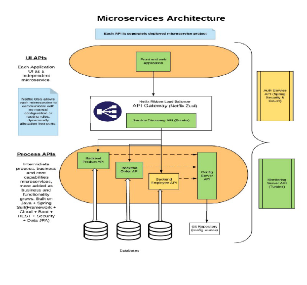
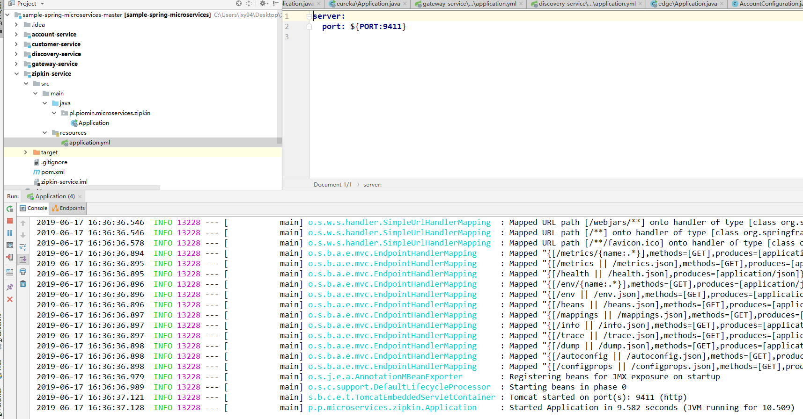
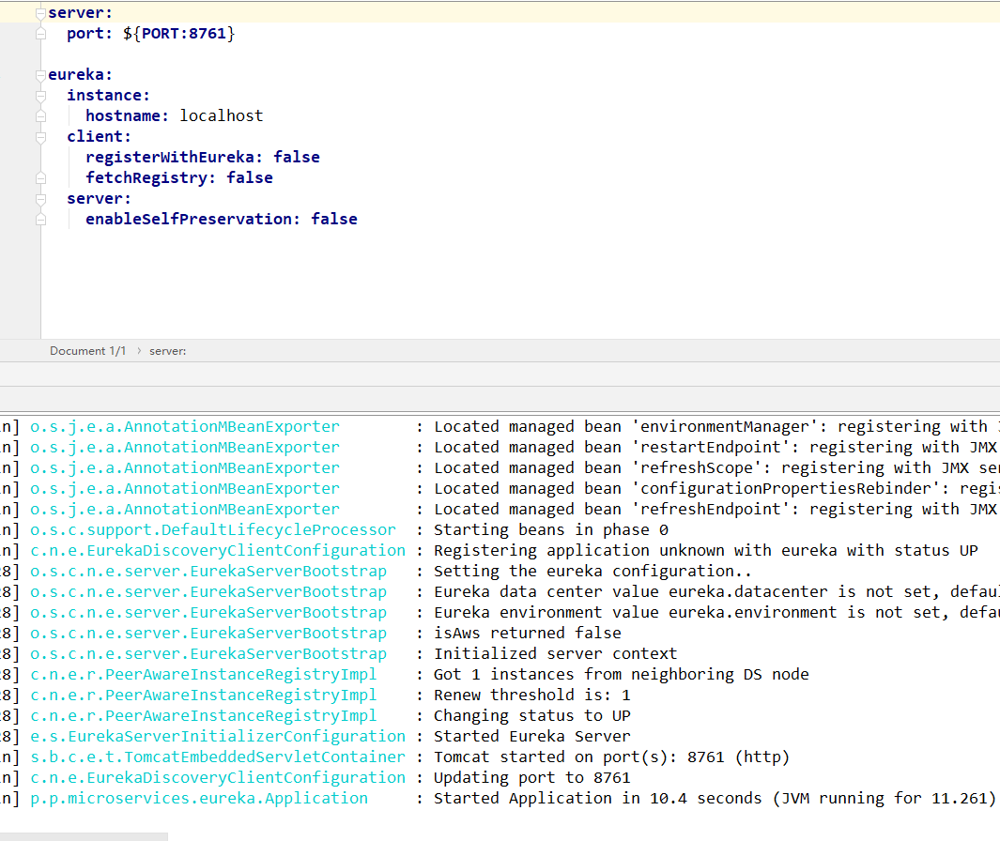
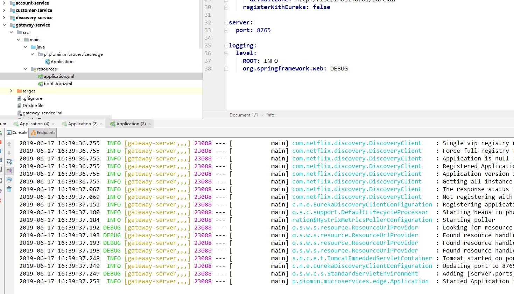
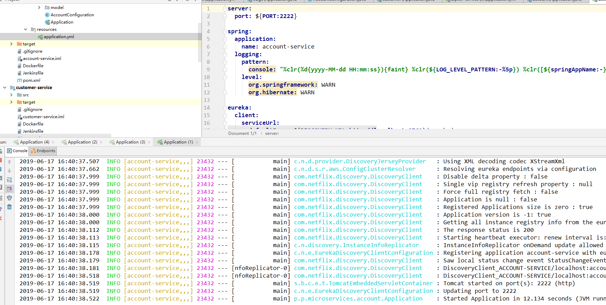
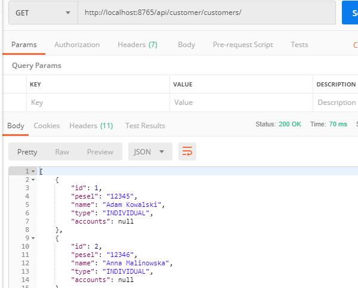

Spring Cloud 练习

第一次作业<https://github.com/mrgh97/sport-club-1>

第二次作业<https://github.com/mrgh97/sport-club-2>

 第三次作业 <https://github.com/lixingyuan1998/sportclub_3>

第四次作业<https://github.com/lixingyuan1998/sportclub_4>

springcloud 练习 <https://github.com/lixingyuan1998/springcloud_test>





zipkin port:9411

```java
@EnableZipkinServer
```




discovery-service

```java
@EnableEurekaServer
```



gateway-service port:8765

```
@EnableZuulProxy
zuul:
  prefix: /api
  routes:
    account: 
      path: /account/**
      serviceId: account-service
    customer: 
      path: /customer/**
      serviceId: customer-service 
```



account-service port:2222

```java
@EnableDiscoveryClient
```



customer-service port:3333

```
@EnableDiscoveryClient
@EnableFeignClients
```




